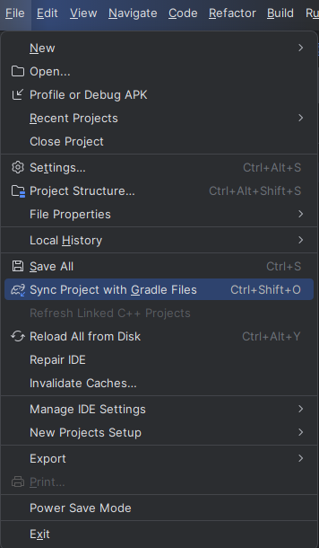
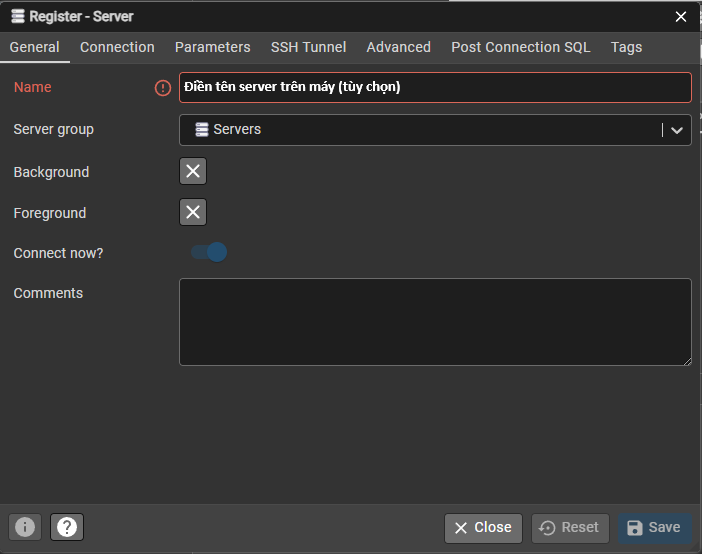
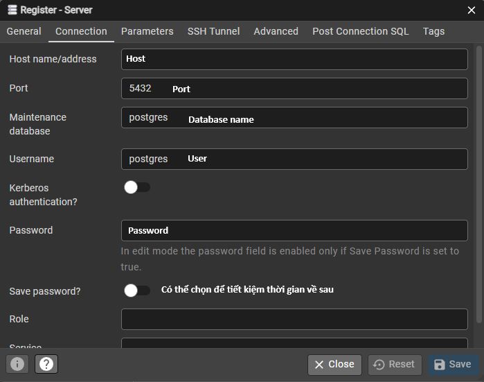
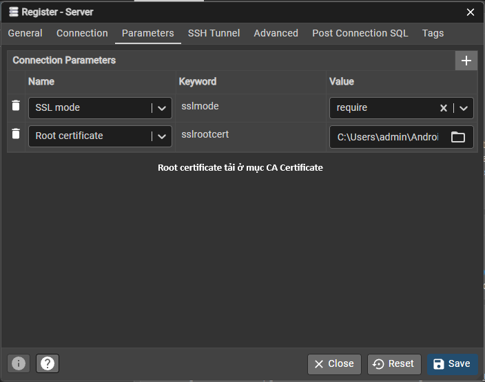

# ENoti - Ứng dụng quản lý và thông báo cho chung cư

## Cách chỉnh sửa ứng dụng:
- B1: Tải Android Studio từ đường link: <a href="https://developer.android.com/studio" target="_blank">Tải về</a>
- B2: Cài đặt Android Studio theo mặc định.
- B3: Sau khi cài đặt xong, chọn clone repository.
- B4: Nhập đường link https://github.com/scarlett1712/NMCNPM_SE-04.git và clone về máy. Thông thường folder khi clone về sẽ nằm ở C:\Users\[Tên user]\AndroidStudioProjects\NMCNPM_SE-04

## Cách để chạy ứng dụng trực tiếp trên máy tính:
- B1: Tại thanh bên tay phải chọn Device Manager.
- B2: Chọn Add A New Device -> Create Virtual Device -> Medium Phone / Pixel 9 Pro -> Finish
(Nếu máy tính đủ khỏe và muốn ứng dụng chạy nhanh: Sau khi chọn mẫu điện thoại, vào mục Additional Settings, kéo xuống phần RAM và tăng kích cỡ (Khuyến khích đẩy lên 4GB vì gần như là chuẩn thấp nhất bây giờ))
2 bước trên chỉ cần thực hiện lần đầu, từ sau không cần thiết.
- B3: Tại thanh trên nhấn vào biểu tượng Run 'app'/bấm tổ hợp Shift + F10 để chạy chương trình

### Lưu ý:
1. Khi chạy sẽ cần mất một khoảng thời gian để khởi động máy ảo. Nếu máy ảo đang hoạt động nhưng app chưa chạy có thể bấm lại thêm 1 lần nữa.
2. Đôi lúc phần mềm hiển thị thông báo Gradle JDK configuration has changed thì chọn Sync Now. Nếu hiển thị lỗi thì chọn Use Embedded JDK.

### EDIT 1 (08:07 AM, 21/10/25): Đôi khi sau khi pull về sẽ gặp tình trạng các function không nhận diện được package và file gốc
-> Trên thanh menu của Android Studio, chọn File -> Sync Project with Gradle Files

### EDIT 2 (UPDATE 11:37 AM, 27/10/25): Hiện tại đã không cần phải chạy server backend local nữa vì đã đẩy được lên cloud server.

### EDIT 3 (12:49 AM, 24/10/25): Hiện tại chưa có phần Đăng ký tài khoản. Nếu muốn thêm tài khoản cần thêm thẳng vào CSDL. 

Trước khi thêm cần encrypt mật khẩu:

- B1: Trong Terminal, chuyển đường dẫn sang folder backend. VD:

 

- B2: Chạy câu lệnh: node createHash.js [Mật khẩu cần mã hóa]. VD:

Dòng cuối chính là mật khẩu sau khi mã hóa và có thể thêm vào CSDL.

### EDIT 4 (ĐM QUÊN 08:30 PM 26/10/2025) 

TK admin: 0936363636 admin123

TK user: 0963291686 123456

Lưu ý: Mỗi khi tạo mới user MK mặc định luôn là 123456

## Cách để chạy và cài đặt ứng dụng qua điện thoại (Khuyến khích dành cho người máy yếu & sử dụng điện thoại Android):
- B1: Trên điện thoại: Truy cập vào Tùy chọn nhà phát triển (Developer options)
Mỗi máy 1 khác, có thể tra cứu cách bật Tùy chọn nhà phát triển qua mạng.
Ví dụ: 

https://github.com/user-attachments/assets/fc0550ce-1bf8-47cf-94dc-236ab38362be

- B2: Bật Gỡ lỗi qua USB, kết nối điện thoại với máy tính thông qua dây cáp có thể truyền dữ liệu.
Lần đầu kết nối với máy tính, điện thoại sẽ hiển thị cửa sổ Cho phép gỡ lỗi qua USB? thì chọn cho phép (Về lâu dài, không muốn nhiều thao tác có thể chọn Luôn cho phép từ máy tính này.)_
- B3: Trên ứng dụng Android Studio sẽ tự nhận dạng điện thoại cắm vào. Khi chạy máy tính sẽ cài đặt ứng dụng vào điện thoại.

## Cách để truy cập và chỉnh sửa CSDL: 
Yêu cầu: Tài khoản Aiven có sẵn trong project.
- B1: Truy cập Aiven console, vào Projects -> se04-enoti -> services -> se-04-enoti
- B2: Truy cập pgAdmin 4, chọn Register -> Server
- B3: Điền đầy đủ thông tin như hình

- B4: Bấm save, nếu làm đúng sẽ kết nối được với CSDL.
